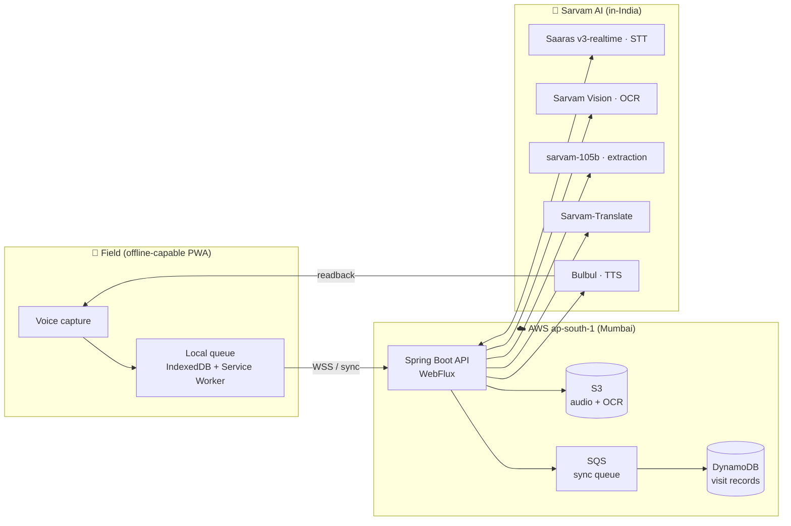

# SwasthyaVaani 🩺🎙️

**Voice-first, offline-capable field documentation for India's frontline health workers — built on Sarvam AI's Indic speech stack and AWS.**

> *Swasthya* (health) + *Vaani* (voice). A health worker just talks; the record writes itself.


---

## The problem

India's ~1 million ASHA and ANM frontline health workers spend a large part of every day on paperwork — logging home visits, maternal and child checkups, immunization status, and referrals into registers and government apps. In practice they:

- are semi-literate in English, yet the forms are English-first,
- speak naturally in **code-mixed dialect** (e.g. *"baby-r weight thik aache, kintu fever holo kal theke"*),
- work in villages with **little or no connectivity**.

The result is delayed, lossy, error-prone health data — the exact data the public-health system depends on.

## The solution

The worker narrates the visit in her own language. SwasthyaVaani:

1. **transcribes** the speech live (code-mixed, Indian-accent),
2. **extracts** a structured visit record — patient, weight, symptoms, next visit date,
3. **reads it back** for confirmation in her language, and
4. **syncs** it to the backend registry when a signal returns — with no data lost and nothing duplicated.

It works fully offline and queues visits until connectivity is available.

## Why Sarvam AI

This is solvable *specifically* because of Sarvam's India-first stack — capabilities global models handle poorly:

- **Code-mixed STT** tuned for Indian accents and dialects (how ASHA workers actually speak).
- **Realtime streaming transcription** (`saaras:v3-realtime`) for a responsive speak-and-see experience.
- **Native-script OCR** (Sarvam Vision) to ingest existing paper registers, not just new entries.
- **In-India data residency**, which is non-negotiable for health PII and a clean compliance story.

The engineering value-add on top is the **offline-first, sync-later architecture** and disciplined PII handling.

---

## Architecture



### Pipeline → Sarvam model mapping

| Step | Sarvam model / endpoint | Purpose |
|---|---|---|
| Live speech capture | `saaras:v3-realtime` (WebSocket) | Streaming, code-mixed STT |
| Batch / fallback STT | Saaras v3 (`transcribe`) | When realtime is unavailable |
| Paper-record ingest | Sarvam Vision (OCR) | Native-script OCR of registers |
| Field extraction | `sarvam-105b` | Transcript → structured record |
| Official-record text | Sarvam-Translate | Formal registry entry |
| Confirmation readback | Bulbul (TTS) | Speak record back in-language |

---

## Tech stack

- **Frontend:** React 18 + TypeScript, Vite, PWA (Workbox), IndexedDB — offline-first, runs on low-end Android.
- **Backend:** Java 21 + Spring Boot 3.x (WebFlux) — reactive streaming to Sarvam, orchestration, sync/reconcile.
- **AI:** Sarvam AI (Saaras, Bulbul, Sarvam-Translate, sarvam-105b, Sarvam Vision).
- **Data:** DynamoDB (records), S3 (audio/OCR), SQS (sync queue).
- **Infra:** AWS CDK (TypeScript), region `ap-south-1`.

---

## Getting started

### Prerequisites

- Java 21, Maven
- Node 20+, pnpm
- An AWS account (for Phase 5 deploy) and AWS CDK
- A Sarvam AI API key — https://docs.sarvam.ai

### Setup

```bash
git clone <your-repo-url> swasthya-vaani && cd swasthya-vaani

# configure secrets (never commit these)
cp backend/.env.example backend/.env       # add SARVAM_API_KEY etc.
cp frontend/.env.example frontend/.env

# backend (multi-module Maven reactor: domain + sarvam + api)
cd backend && ./mvnw -pl swasthyavaani-api -am spring-boot:run
#   health: http://localhost:8080/actuator/health   ping: http://localhost:8080/api/v1/ping

# frontend (new terminal)
cd frontend && pnpm install && pnpm dev

# ...or start both at once
./scripts/dev.sh
```

Open the printed local URL, install the PWA, and try a recording. See `CLAUDE.md` for the full command list and build phases.

---

## Project structure

```
swasthya-vaani/
├── CLAUDE.md              # build guidance for Claude Code
├── README.md
├── docs/                  # architecture, Sarvam integration, data model, roadmap, progress
├── infra/                 # AWS CDK (TypeScript) — Phase 5
├── backend/               # Spring Boot service (multi-module Maven)
│   ├── swasthyavaani-domain    # pure records + enums (the shared contract)
│   ├── swasthyavaani-sarvam    # SarvamClient interface + single WebClient impl
│   └── swasthyavaani-api       # WebFlux app: endpoints, health, wiring
├── frontend/              # React PWA (Vite + TS + Workbox)
│   └── android/                # Capacitor native Android wrapper (same codebase)
└── scripts/               # dev / seed + synthetic fixtures
```

### Android app

The PWA also ships as a native Android app via **Capacitor** — one codebase, native audio
capture on-device. `cd frontend && pnpm build && pnpm cap:sync && pnpm android:open`
(APK build needs the Android SDK). See **[`docs/android.md`](./docs/android.md)**.

---

## Roadmap

- [x] **Phase 0** — Repo scaffold, `SarvamClient` abstraction, health checks
- [x] **Phase 1** — Online happy path: record → STT → extraction → structured record
- [x] **Phase 2** — Bulbul TTS readback + edit-and-correct
- [ ] **Phase 3** — Realtime STT + full offline queue and idempotent sync
- [ ] **Phase 4** — Sarvam Vision OCR ingest of paper records
- [ ] **Phase 5** — CDK deploy to `ap-south-1` + runbook

Full breakdown by track and feature is in **[`docs/roadmap.md`](./docs/roadmap.md)**; live
status is tracked in **[`docs/progress.md`](./docs/progress.md)**. Architecture and verified
Sarvam contracts: **[`docs/architecture.md`](./docs/architecture.md)** ·
**[`docs/sarvam-integration.md`](./docs/sarvam-integration.md)**.

---

## Data & privacy

- All processing and storage stays **in India** (`ap-south-1`); Sarvam processes in-India by design.
- Every visit record is treated as sensitive PII: encrypted at rest and in transit, never logged, never sent outside the in-India Sarvam endpoint.
- The PoC uses **synthetic data only** — no real patient information.

## Disclaimer

SwasthyaVaani is a **proof-of-concept**, not a certified medical device. It records and structures what a health worker dictates; it does **not** diagnose, advise on treatment, or make clinical decisions.

## License

MIT — see [LICENSE](./LICENSE).

---

*Built to explore India-first AI: Sarvam's Indic speech models applied to a real frontline problem, with production-grade cloud architecture around them.*
