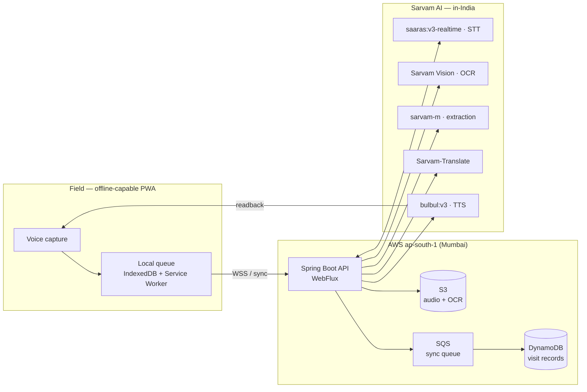
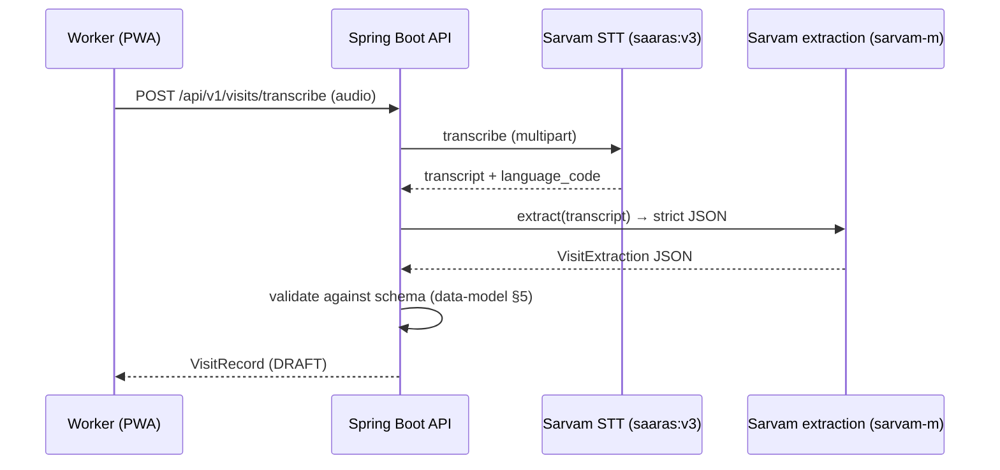
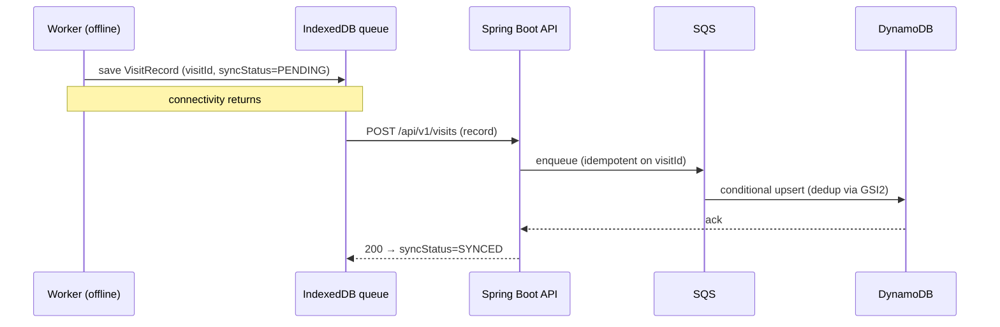

# Architecture

Living architecture document for **SwasthyaVaani**. This is the source of truth for how
the system is structured and *why*. When a non-obvious decision is made, append an
ADR-lite entry to §7 (context → decision → consequence).

> Companion docs: [`sarvam-integration.md`](./sarvam-integration.md) (verified vendor
> contracts), [`data-model.md`](./data-model.md) (visit-record schema),
> [`roadmap.md`](./roadmap.md) (tracks & features), [`progress.md`](./progress.md)
> (live status).

---

## 1. System context



Two independent design goals drive everything:

1. **Indic-first voice** — only achievable because of Sarvam's code-mixed STT,
   Indian-accent TTS, native-script OCR, and in-India residency.
2. **Offline-first, sync-later** — the engineering value-add layered on top: a worker
   completes and queues a visit with zero connectivity, then reconciles later with no
   loss and no duplicates.

---

## 2. Component responsibilities

| Component | Responsibility | Notes |
|---|---|---|
| **React PWA** | Capture audio, run the local visit queue, reconcile when online, render the readback/edit loop | Installable, works fully offline (Workbox + IndexedDB) |
| **Spring Boot API** | Orchestration: proxy Sarvam realtime STT over WSS, run extraction/validation, generate TTS readback, manage sync/reconcile | Reactive (WebFlux); all vendor access via `SarvamClient` |
| **`SarvamClient`** | Single seam to every Sarvam capability | One interface, one impl; no SDK leakage into controllers/UI |
| **DynamoDB** | Durable visit records | Single-table design (see `data-model.md` §6) |
| **S3** | Audio + transcript + OCR blobs | SSE at rest, TLS-only bucket policy |
| **SQS** | Sync/reconcile work queue | Idempotent consumers keyed by `visitId` |

---

## 3. Backend module layout (multi-module Maven)

The backend is a multi-module Maven reactor rooted at `backend/pom.xml`. Modules are
sliced by responsibility so the vendor seam and the domain stay free of framework and
web concerns.

```
backend/                          (parent reactor — packaging: pom)
├── swasthyavaani-domain          pure Java: records, enums, schema constants
│                                 — no Spring, no web, no vendor types
├── swasthyavaani-sarvam          the SarvamClient interface + single WebClient impl,
│                                 config props, request/response DTOs, resilience
└── swasthyavaani-api             Spring Boot app: WebFlux endpoints, health/actuator,
                                  wiring, application config
```

**Dependency direction is strictly one-way** (no cycles):

```
swasthyavaani-api ──▶ swasthyavaani-sarvam ──▶ swasthyavaani-domain
        └───────────────────────────────────────────▶ (also depends on domain)
```

- `domain` depends on nothing but Jackson annotations. It is the shared contract.
- `sarvam` depends on `domain` (it produces `VisitExtraction`) and on Spring WebFlux
  `WebClient` for HTTP. It must never depend on `api`.
- `api` depends on both and owns all Spring Boot wiring and HTTP endpoints.

Rationale: the domain model can be reused by an SQS worker, a CLI seeder, or tests
without dragging in the web layer; the vendor client can be tested in isolation; and the
"abstract the vendor" rule (`CLAUDE.md` §6) is enforced by module boundaries, not just
convention.

### Package roots

- `ai.swasthyavaani.domain.*` — model, enums, extraction contract.
- `ai.swasthyavaani.sarvam.*` — `SarvamClient`, `config`, `model`, `impl`.
- `ai.swasthyavaani.api.*` — application, web controllers, config, health.

---

## 4. Request/data flows

### 4.1 Online happy path (Phase 1)



### 4.2 Readback loop (Phase 2)

Draft record → `bulbul:v3` TTS in the worker's language → worker confirms or edits →
`confirmationStatus` moves `DRAFT → CONFIRMED | EDITED`. Repeated confirmations of the
same text are cached (TTS is metered).

### 4.3 Offline capture + sync (Phase 3)



Idempotency is anchored on the **client-generated `visitId` (UUID v4)** — see
`data-model.md` §7. Re-sending the same record is a no-op success.

---

## 5. Cross-cutting concerns

- **Resilience.** Every Sarvam call has a connect/read timeout, bounded retry with
  exponential backoff + jitter, and a defined offline fallback (§6 fallbacks). Failures
  fail loud in dev and degrade gracefully in the field.
- **Config over code.** Everything environment-specific comes from Spring config / env
  vars. Target languages are a config list (default `bn-IN`, `en-IN`), so other states
  plug in without code changes.
- **Observability.** Structured logging (no PII — see §6), Actuator health/metrics,
  correlation id per request/visit.
- **Security & residency.** TLS/WSS in transit; S3 SSE + DynamoDB encryption at rest;
  region pinned to `ap-south-1`; no dependency may ship PII outside India.

---

## 6. Degradation ladder (hard constraint §5 of CLAUDE.md)

| Condition | Behaviour |
|---|---|
| All healthy | Realtime streaming STT → live extraction → TTS readback → sync |
| Realtime STT down | Record locally, then batch-transcribe when reachable |
| Sarvam fully unreachable | Still capture + queue raw audio and allow manual entry; sync later |
| Backend unreachable | PWA keeps working fully offline; queue drains on reconnect |

**PII rule for all layers:** `beneficiary.name` and free-text are never logged, never in
commit history, never sent anywhere except the in-India Sarvam endpoint.

---

## 7. Decision log (ADR-lite)

Append entries here; newest last. Format: **context → decision → consequence**.

### ADR-001 — Multi-module Maven backend
- **Context.** The vendor-abstraction rule and a future SQS worker both want the domain
  model without the web stack.
- **Decision.** Split the backend into `domain`, `sarvam`, and `api` Maven modules with a
  strictly one-way dependency graph.
- **Consequence.** Slightly more pom boilerplate; in exchange, enforced boundaries, faster
  isolated tests, and reuse of the domain by non-web consumers.

### ADR-002 — Reactive stack (Spring WebFlux)
- **Context.** Realtime STT is a streaming WebSocket; blocking I/O would tie up threads
  per stream.
- **Decision.** Use Spring WebFlux + reactive `WebClient` for all Sarvam I/O.
- **Consequence.** Non-blocking streaming and back-pressure; the team must stay disciplined
  about not blocking inside reactive chains.

### ADR-003 — Verified vendor model names differ from CLAUDE.md
- **Context.** `CLAUDE.md` §6 lists `sarvam-105b` (extraction) and "Bulbul" (TTS). Live
  Sarvam docs (verified via Context7, Aug 2026) expose `sarvam-m` for chat/completions and
  `bulbul:v3` for TTS; STT is `saaras:v3` (`saaras:v3-realtime` for streaming).
- **Decision.** Treat the live contract as source of truth and make the model id a config
  value (`sarvam.models.*`) behind `SarvamClient`, defaulting to the verified names.
  `sarvam-105b` is retained only as a documented alias/assumption to confirm with Sarvam.
- **Consequence.** Swapping a model is a config change, not a code change; the CLAUDE.md
  mapping is honoured at the capability level even where the concrete id evolved. See
  `sarvam-integration.md` §2.

### ADR-004 — Phase 1 draft response shape & `visitId` fallback
- **Context.** The transcribe endpoint must return the structured record *and* the raw
  transcript (so the UI can fall back to manual entry when extraction doesn't validate),
  and a client may not yet supply the client-generated `visitId` (that becomes mandatory
  for offline idempotency in Phase 3).
- **Decision.** Return a `VisitDraftResponse { visit, transcript, extractionValid,
  validationMessages }` rather than a bare `VisitRecord`. The transcript is *not* stuffed
  into the record (it stays an S3 pointer per `data-model.md` §2). If the request omits
  `visitId`, the server generates a UUID v4; when the client supplies one it is honoured.
- **Consequence.** The UI always has the transcript for review/manual entry; every visit is
  `DRAFT`/`PENDING` at this stage. Phase 3 tightens `visitId` to client-supplied-always for
  exactly-once sync, and moves audio/transcript to S3.

### ADR-005 — Extraction failures degrade, they don't 500
- **Context.** `sarvam-m` can occasionally return non-conformant JSON; the field must never
  lose a visit over it (`CLAUDE.md` §5, §7.5).
- **Decision.** STT failure surfaces as `502` (upstream) via `GlobalErrorHandler`, but an
  extraction/validation failure returns a `DRAFT` with the transcript and
  `extractionValid=false` for manual entry — not an error.
- **Consequence.** The worker can always complete a visit; bad extractions become review
  work, not lost data.
